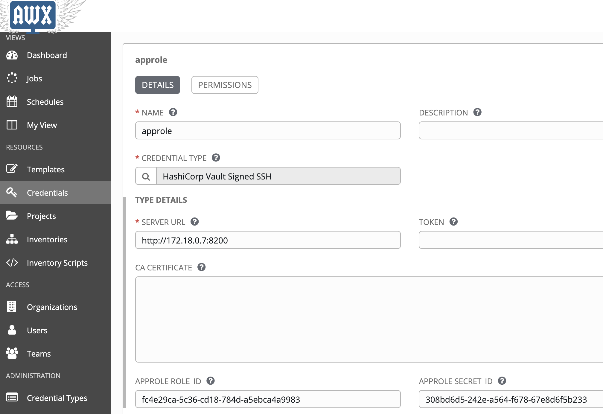
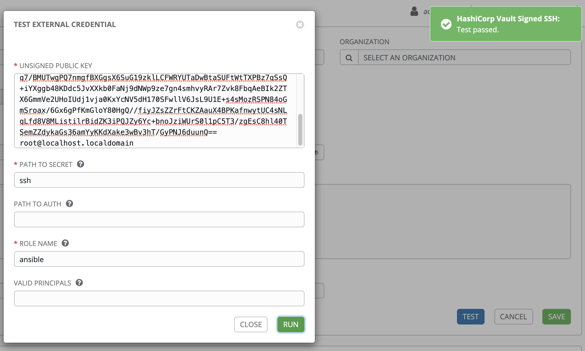

## Testing Ansible AWX with HashiCorp Vault AppRole authentication 
This repo provides steps for testing a modified version of HashiCorp Vault credentials plugin: [hashivault.py](assets/hashivault.py.v1) to support Vault [AppRole Authentication](https://www.vaultproject.io/docs/auth/approle/) method. 

Please see the testing steps below:
- Pre-requisite: Approle Vault setup 
- Testing on an existing Docker install 
- Testing AppRole on new install on CentOS 8 using Vagrant
- Testing AppRole on new install on CentOS 8 on AWS (Coming soon)

### Pre-requisite: AppRole Vault setup
To setup the AppRole Authentication method in Vault, we assume you have the vault binary on your path already. Please export an admin Vault token and Vault API address as below:
```
export VAULT_ADDR="https://<vault-dns>"
export VAULT_TOKEN="<root-or-admin-token>"
cd assets/
chmod +x setup-vault.sh
./setup-vault.sh
```

### Testing on an existing Docker install
To test the modified version of Vault credentials plugin on an existing Docker based AWX deployment, please use the following steps:
```
# Run from the root of awx/ repo:
docker rm awx_web
docker rm awx_task
cd awx/installer
/usr/local/bin/ansible-playbook -i inventory install.yml

# Run from the root of this repo:
docker cp assets/hashivault.py.v1 awx_task:/var/lib/awx/venv/awx/lib/python3.6/site-packages/awx/main/credential_plugins/hashivault.py
docker cp assets/hashivault.py.v1 awx_web:/var/lib/awx/venv/awx/lib/python3.6/site-packages/awx/main/credential_plugins/hashivault.py
```

Please continue with the **Test AppRole Authentication** section

### Testing on Vagrant CentOS 8 Ansible AWX install
These steps can be used to provision a CentOS 8 Vagrant VM and install the Ansible AWX application using Docker. A Docker vault dev server is also provisioned for testing AppRole Authentication.

Before running `vagrant up`, any customizations should be made to the [inventory](assets/inventory) file such as admin passwords etc. Choosing non-default passwords are recommended.

### Runing Vagrant
To provision, please run the command below:
```
vagrant up
```
**Note: You may get the following error, please re-reun `vagrant up` and it will continue to provision the machine
```
The following SSH command responded with a non-zero exit status.
Vagrant assumes that this means the command failed!
```

### Access AWX
After the setup scripts finish, you should be able to access AWX web console at: `http://localhost:9080`. Please access it from a private browser session as there might be cached parts of the AWX external credentials UI. The default password is admin/password.

### Test AppRole Authentication
Screenshots are shown below, more steps coming soon.
- From the Dashboard, click "Credentials" > "+" > Search 
- Search for hashicorp and choose Credential Type "HashiCorp Vault Signed SSH"
- Put Vault address and a Role ID and Secret ID. These were saved in the `/home/vagrant/assets` directory in the `roleid.json` and `secretid.json` file.





**Vault Audit entries 
To review corresponding Vault audit entries, please use the commands below:
```
sudo docker exec -it vault "/bin/sh"
tail -f /tmp/vault_audit.log
# Perform some AppRole logins now to view Auth requests
```

** Example Audit entries:
- Approle login request and response with correct policies being mapped:
```
{"time":"2020-03-06T03:24:31.062003966Z","type":"request","auth":{"token_type":"default"},"request":{"id":"977a96c1-095c-2c5a-6637-5dc584b823f1","operation":"update","namespace":{"id":"root"},"path":"auth/approle/login","data":{"role_id":"hmac-sha256:f5037a656c39088abd6d3f0b2e74534b5543ad5c02dbb2da24e99dc6b63a05e3","secret_id":"hmac-sha256:1c29e88bbe7af4efe38e304017c402e6a210fcfd8c10d81e82f6fc08555c171c"},"remote_address":"172.18.0.5"}}

{"time":"2020-03-06T03:24:31.062818429Z","type":"response","auth":{"client_token":"hmac-sha256:e1afe3de4a437d3f1847779b6428f7ad07d01f19c8f6795ff0aeb0a02c834d03","accessor":"hmac-sha256:99174d26d1c642d81b72d29b57b43bab40e02e2122ecd04acca57c093545482e","display_name":"approle","policies":["ansible-ssh","default"],"token_policies":["ansible-ssh","default"],"metadata":{"role_name":"ansible"},"entity_id":"a4db4ab3-7605-f51c-cf0c-344245782f98","token_type":"service"},"request":{"id":"977a96c1-095c-2c5a-6637-5dc584b823f1","operation":"update","namespace":{"id":"root"},"path":"auth/approle/login","data":{"role_id":"hmac-sha256:f5037a656c39088abd6d3f0b2e74534b5543ad5c02dbb2da24e99dc6b63a05e3","secret_id":"hmac-sha256:1c29e88bbe7af4efe38e304017c402e6a210fcfd8c10d81e82f6fc08555c171c"},"remote_address":"172.18.0.5"},"response":{"auth":{"client_token":"hmac-sha256:e1afe3de4a437d3f1847779b6428f7ad07d01f19c8f6795ff0aeb0a02c834d03","accessor":"hmac-sha256:99174d26d1c642d81b72d29b57b43bab40e02e2122ecd04acca57c093545482e","display_name":"approle","policies":["ansible-ssh","default"],"token_policies":["ansible-ssh","default"],"metadata":{"role_name":"ansible"},"num_uses":100,"entity_id":"a4db4ab3-7605-f51c-cf0c-344245782f98","token_type":"service"}}}
```
- Certificate signing request with AppRole token:
```
{"time":"2020-03-06T03:24:31.06743862Z","type":"request","auth":{"client_token":"hmac-sha256:e1afe3de4a437d3f1847779b6428f7ad07d01f19c8f6795ff0aeb0a02c834d03","accessor":"hmac-sha256:99174d26d1c642d81b72d29b57b43bab40e02e2122ecd04acca57c093545482e","display_name":"approle","policies":["ansible-ssh","default"],"token_policies":["ansible-ssh","default"],"metadata":{"role_name":"ansible"},"remaining_uses":100,"entity_id":"a4db4ab3-7605-f51c-cf0c-344245782f98","token_type":"service"},"request":{"id":"40251df9-54fb-b3dd-8301-e3bdc80e685e","operation":"update","client_token":"hmac-sha256:e1afe3de4a437d3f1847779b6428f7ad07d01f19c8f6795ff0aeb0a02c834d03","client_token_accessor":"hmac-sha256:99174d26d1c642d81b72d29b57b43bab40e02e2122ecd04acca57c093545482e","namespace":{"id":"root"},"path":"ssh/sign/ansible","data":{"public_key":"hmac-sha256:690abcb0efafe6b2c07bc9493393e819b7841b5eff6d491fd7ea9eabef86e281"},"remote_address":"172.18.0.5"}}
```

### Destroy
To destroy, run the command `vagrant destroy`.